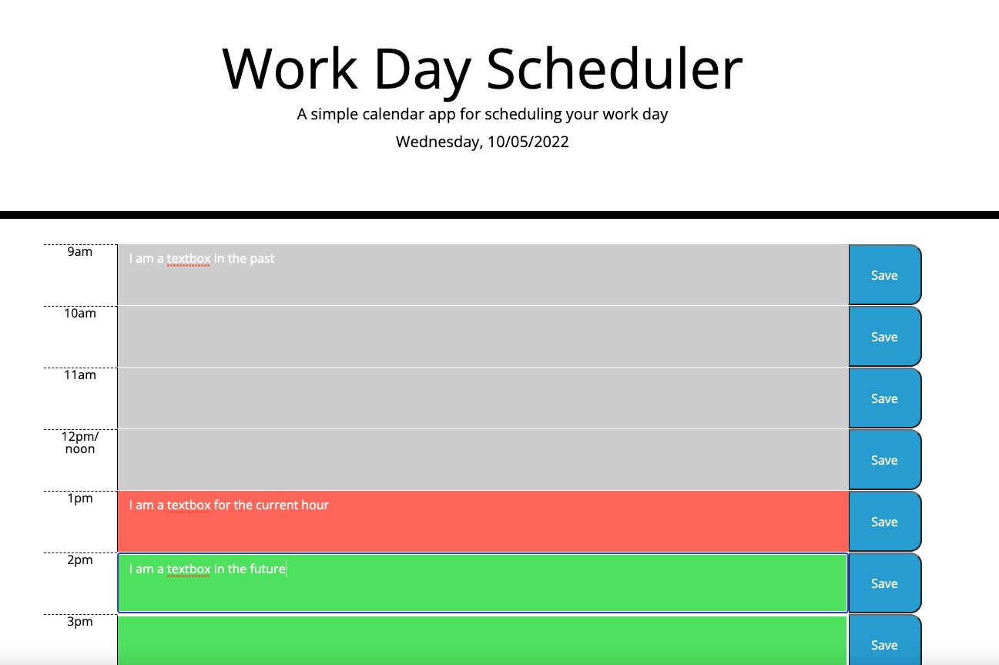

# Day-Schedule

# Code Quiz

## Site Picture

Deployed Link
https://wseban.github.io/Code-Quiz/

## Usage
The user is presented with the current day of the week and date in the header.  Within the body they are presented with fill in text boxes that are color coordinated to show whether that hour has past or not...



## Technologies Used
- Bootstrap - a third party API with pre designed elements advancing the range of style on a webpage.
- Jquery - a third party API that assists in condensing Javascript and allowing more versatility.
- moment.js - a third party API that allows formatting and manipulation of current time stamps.
- JavaScript - Allows developer to make static webpages, dynamic and interactive.  For this exercise it was used to alter the original webpage to change the questions, change   the answers, add a dynamic timer/countdown(that also ends the game), as well as, allow saving of scores.
- HTML - Gives a basic static structure to the webpage.
- CSS - Allows the developer to make the webpage a little more appealing.
- Git - Git is what I used to work on my personal computer and pushing my work to GitHub.
- GitHub - A cloud based repository that holds my saved code reserved for resetting my personal computer deployment.

## Description

The purpose of this project was to utilize our skills with jQuery, Bootstrap and moment.js to create a dynamic day scheduler.  This scheduler uses local storage to allow the user the ability to save daily todo lists as well as explicitly remind them that certain hours are past, present or future using color combinations with moment.js.

## Installation

NA

## Lessons Learned
The most effective lessons learned for me were...
1. Using and manipulating bootstrap within parameters as to not change the overall look of elements.
2. Learning local storage and being able to manipulate information to set and get from storage. 


## Code Snippets
JavaScript
```javaScript
function questionTwo(event){
    if(event.target.textContent === answer1){
      score++;
    }
    else{
        timeCount = timeCount - 5;
    }

function qTimer(){
    timeRemaining = setInterval(function(){
        timeCount--;
        console.log(timeCount)
        timerTracker.textContent = Math.floor(timeCount);
        if (timeCount <= 0){
            timeCount = 0;
            clearInterval(timeRemaining);
            endGame();
        }
    }, 1000)
}

startQuizBtn.removeEventListener("click", endQuiz);
    startQuizBtn.addEventListener("click", begin);
    startQuizBtn.textContent = "Again?"

```
## Credits

NA

## License
Please refer to the LICENSE in the Repo.